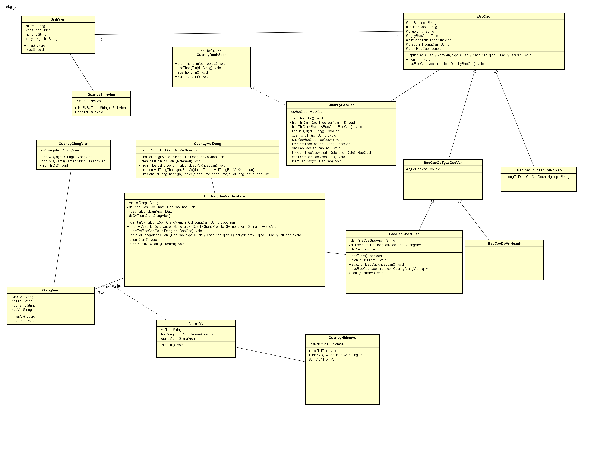

# Hệ thống QUẢN LÝ BÁO CÁO KHOA CNTT

## Mô tả

Hệ thống quản lý báo cáo của Khoa CNTT được phát triển để theo dõi tiến độ của sinh viên trong việc hoàn thành các báo cáo chuyên ngành. Hệ thống tích hợp thông tin chi tiết về sinh viên và các báo cáo, cung cấp chức năng quản lý linh hoạt và gắn kết giữa sinh viên và giảng viên. Điều này giúp tối ưu hóa quản lý và đánh giá chất lượng của các báo cáo, đồng thời đảm bảo sự minh bạch và công bằng trong quá trình học tập và nghiên cứu.

## Sơ đồ lớp (Class Diagram)

Dưới đây là sơ đồ lớp của hệ thống QUẢN LÝ BÁO CÁO KHOA CNTT:

